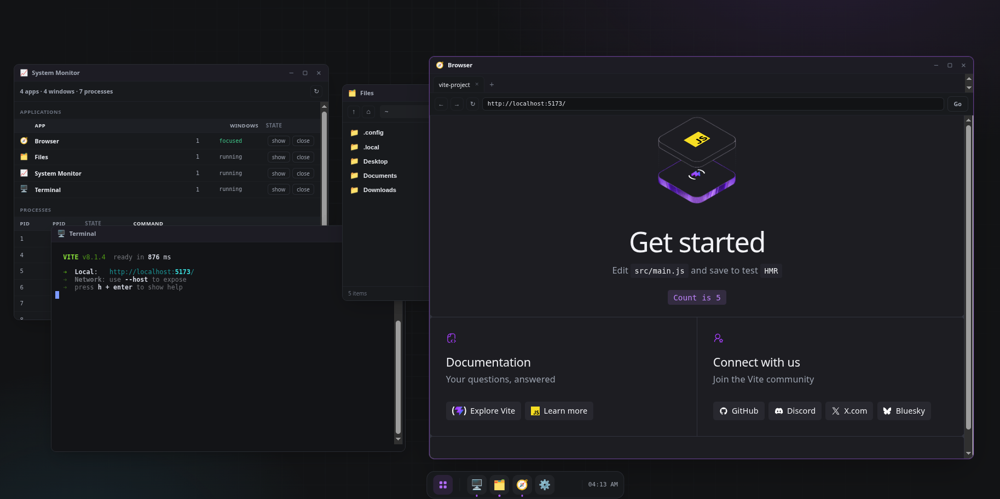

<div align="center">

# WorkerOS

</div>

> An operating system that boots in a Web Worker



A real kernel running real processes — where JS and WASM are the native executable format. POSIX-style coreutils and bash-like scripting.
The executable format is a JS or WASM module, not a native binary; the "CPU" is
the host's own JS/WASM engine.

## Usage

```js
import { boot } from "@opentf/workeros-web";

// Boot the Rust→WASM kernel inside a Web Worker.
const os = await boot();

// The VFS is real: write a file, then run a program.
await os.fs.write("/hello.txt", "from the WorkerOS VFS\\n");

// wsh: pipes, &&, redirects, glob — executed by the kernel.
await os.exec("cat /hello.txt | cat && ls /sbin", {
  onStdout: (b) => screen.write(b),
});

// Processes are real — inspect the live table.
const procs = await os.ps();
```

## Develop

Requires a Rust toolchain with the `wasm32-unknown-unknown` target, `wasm-pack`,
and Node.js.

```sh
# Native kernel tests (pure logic — no browser needed)
cargo test --workspace --exclude workeros-web-wasm

# Node-ism grep gate (keeps the kernel Node-agnostic — INV-1)
./ci/grep-gate.sh

# Build the kernel wasm + host runtime, then serve with COOP/COEP
cd packages/workeros-web
npm install
npm run build:wasm            # or build:wasm:dev
npm run serve                 # http://localhost:8080

# Headless browser tests (boot handshake + MVP acceptance)
npm test
```

Open a demo at
`http://localhost:8080/examples/run-js/index.html` (run a JS program) or
`http://localhost:8080/examples/shell/index.html` (the `wsh` terminal).

Cross-origin isolation (COOP: `same-origin`, COEP: `require-corp`) is required
for `SharedArrayBuffer`; the dev server sets these headers (ADR-010).

To debug a guest program (a hang, a bad `fs` access), enable the kernel tracer
(`os.trace(...)`) or drive real programs with the e2e harness — see
[DEBUGGING.md](DEBUGGING.md).

## License

Apache-2.0. See [NOTICE](./NOTICE) for attribution details.
